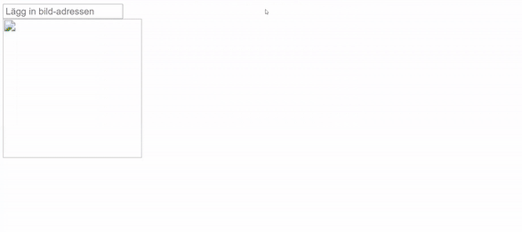

# 230s-javascript-html-css-prov
## Regler
* Inte tillåtet att hjälpa varandra på något sätt, räknas som fusk.
* Det är tillåtet att använda internet hur mycket man vill. 
Men absolut inte tillåtet att använda någon form av AI verktyg som Copilot, Chat-GPT m.m. Det räknas som fusk och leder till underkänt.


* Börja med att skapa ett projekt via länken till Github Classroom och klona projektet.
<br>
```git clone https://github.com/abbjetmus/240s-javascript-prov.git```
<br>

* Efter provet kan ni skicka in era ändringar till repot som ni klonade genom att göra en git push från Visual Studio.<br><br>

## Att tänka på

Varje fråga består av en html fil med uppgiftsnumret.<br>
Html filen innehåller en html mall med nödvändiga taggar och en ```script``` tagg där ni ska lägga in er javascript kod.<br>
För att starta programmet dubbel-klickar du bara på html filen i filutforskaren och den öppnas i webbläsaren. Sedan när du gör ändringar i filen laddar du om webbläsaren för att dina ändringar ska synas.
Du får använda valfri editor för att koda men rekommenderar Visual Studio Code.

## Fråga 1 - Variabler
1. Skapa två variabler en som heter <b>height</b> som du tilldelar ett valfritt tal/nummer, och en som heter <b>width</b> som du också tilldelar ett tal till.
2. Skapa sedan en variabel <b>omkrets</b> som tilldelas additionen av variablerna height och width så att omkretsen beräknas. Dvs omkretsen av en rektangel med variablerna där width och height är sidorna.<br>
3. Skriv ut omkrets variabeln till konsolen eller med alert.

## Fråga 2 - HTML/CSS
1. Skapa en div-tagg och ange den en klass med namnet **rectangle**. Definera klassen rectangle i *style* taggen innan för head.
2. Rectangle klassen ska ha följande egenskaper:
* height: 300px;
* width: 300px;
* margin: 20px;
* padding: 20px;
* background-color: red;

## Fråga 3 - Array/lista
1. Skapa en array/lista med text-strängarna "kalle", "pelle" och "nalle" och tilldela den till en variabel som heter **names**.
2. Skriv ut till konsolen med hjälp av listan andra namnet i listan, dvs namn "pelle" med rätt index.

## Fråga 4 - If-satser
Läs in ett tal med <i>prompt()</i> och lagra det i en variabel som heter <b>myNumber</b>.
Använd if-satser för att kontrollera ifall talet är mellan 5 och 10. Är fallet sådan skriver du ut "Talet är mellan 5 och 10".<br>
Annars skriver du ut "Talet är inte mellan 5 och 10".


## Fråga 5 - For-loopen
 
Skapa en for-loop som loopar igenom talen 0 till 20 och skriver ut talet till konsolen.


## Fråga 6 - For-loop på lista med objekt

Du har en lista nedan med objekt som innehåller information om politiker.

```
[{id: 1, firstName: 'Stefan', lastName: 'Löven'},
{id: 2, firstName: 'Annie', lastName: 'Lööv'},
{id: 3, firstName: 'Nyamko', lastName: 'Sabuni'},
{id: 4, firstName: 'Jimmie', lastName: 'Åkesson'},
{id: 5, firstName: 'Per', lastName: 'Bolund'},]
```
1. Skapa en data variabel med namnet **politiker** som tilldelas listan med fem objekt med politiker:

2. Loopa sedan igenom listan och skriv ut information om varje list-objekt på följande format:
**firstName - lastName**, för första objektet skulle det se ut så här **Stefan - Löven**.

## Fråga 7 - Funktioner
1. Skapa två funktioner **area** och **volume** för beräkning av area och volym. Area ska ta in två parametrar **x** och **y** och returnera arean av dem dvs multiplikationen. <br>Volume ska ta in 3 parametarar **x**, **y** och **z** och returnera volymen av dem dvs multiplikationen.
2. Anropa sedan varje funktion med valfria värden på parametrarna och skriv ut resultatet till konsolen.


## Fråga 8 - Filtrering med Callback
Du har en lista med siffror 
```js
let numbers = [12, 25, 37, 43, 59, 61]
```
Skapa en funktion som heter filterEvenNumbers som använder array-metoden filter() för att filtrera ut alla jämna nummer från listan och returnera en ny lista. Anropa funktionen och skriv ut den nya listan i konsolen.

Tips: <https://www.w3schools.com/jsref/jsref_filter.asp>

## Fråga 9 - HTML/JavaScript 
1. Skapa en input-tagg med **id="adress"** som tar in en bild-adress dvs text.
2. Skapa en knapp-tagg (button) bredvid input-taggen som när man klickar på den ska köra en funktion som heter *showImage()* som du definerar i script-taggen.
3. Skapa under dessa en img-tagg med **id="bild"** som du ändrar *src*-attributet på från din showImage() funktion till det som kopierades in i input-taggen.
4. Bilden ska sedan synas.

Notera att knappen som ni klickar på inte finns med i gifen/klippet.
### Resultat

